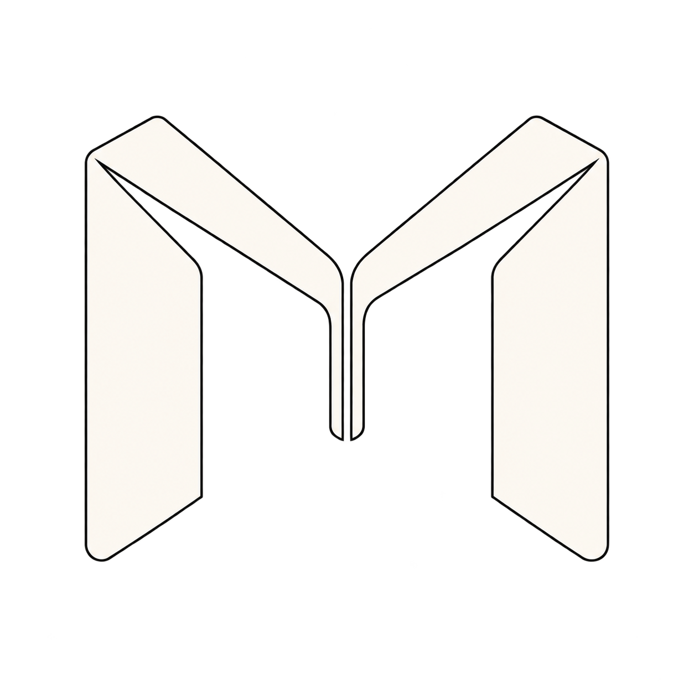

<p align="center">
  <a href="https://meshmatch.net">
    
  </a>
</p>

# Meshmatch

**How well can the same AI model reconstruct an object across different coding harnesses?**

Meshmatch explores how model–harness interaction affects visual reasoning and the ability to turn a reference image into editable 3D geometry. Given the same image and prompt, each model works in Blender through a coding harness’s native `/goal` mode.

There is no aggregate score or leaderboard. The results are presented for visual inspection alongside the time, tokens, and tool calls used to produce them.

**[Explore the results → meshmatch.net](https://meshmatch.net)**

## The published experiments

The current comparison covers **four objects and three harnesses: Codex, Claude Code, and Kimi Code**, with two models per object. These pairings use Vercel AI Gateway with High reasoning effort requested.

| Reference objects | Models compared across all three harnesses |
| --- | --- |
| Desk lamp · Stapler | Gemini 3.8 Flash High · GPT 5.6 Luna High |
| Mouse · Sunglasses | Gemini 3.8 Flash High · GPT 5.6 Terra High |

On the website, you can compare the final renders, inspect the models in an interactive 3D viewer, watch saved render checkpoints evolve, and compare run statistics.

The repository also includes Cursor and Antigravity CLI integrations and earlier compatibility checks. They are separate from the four-object comparison above. See the [pairing verification notes](docs/pairing-verification.md) for the routes tested and their limitations.

## Methodology

Each run receives the same [reconstruction prompt](prompts/reconstruction-draft.md) and reference image in a fresh, isolated [Modal](https://modal.com) sandbox. The shared environment uses Blender 5.2.1 and a pinned revision of the [official Blender MCP server](https://projects.blender.org/lab/blender_mcp). The prompt asks the model to create its own geometry and materials, inspect its work, and refine it against the reference; downloaded assets and using the reference as a texture are prohibited.

Native goal mode lets the harness continue working toward the supplied objective through tool use, inspection, and refinement. Meshmatch does not add its own continuation or feedback loop. **Each run has a 90-minute agent time limit.** Runs that reach it are stopped, and their latest saved work is preserved as-is. A run can finish earlier; process exit and native goal completion are recorded separately.

Saved-file checkpoints are collected during the run. Afterward, a separate sandbox renders six orthographic views of the saved scene using consistent lighting and camera framing. These views are for inspection and are never fed back to the agent. Setup, collection, and independent rendering are outside the agent’s 90-minute window.

The exact environment, lifecycle, collected files, and camera settings are documented in [Running experiments](docs/experiments.md).

## Reading the results

This is a small, exploratory comparison, not a statistically established ranking. The model coverage differs by object, and a harness declaring its goal complete does not establish that the reconstruction is accurate.

- **Time** measures the harness driver’s elapsed runtime, including CLI startup. Reaching the limit is not successful completion.
- **Tokens** count input, including cache reads and writes, plus output. Accounting is normalized from the available harness records. A **≥** marks recovered usage for recorded Gateway requests: the complete run may have used more. Token totals are not dollar costs.
- **Tool calls** count recorded harness-level invocations, not every operation inside a shell command or Blender script.
- **Evolution** shows sampled saved renders, not a continuous recording. Frames play at equal intervals; timestamps record when checkpoints were observed.

Some collection failures required recovering saved artifacts, one output was rebuilt from its saved script, and a failed run was rerun. Recovery code preserves original records and does not treat the existence of an image as proof of native completion. See the [data and accounting notes](frontend/README.md#data-flow).

## Run an experiment

You need Python 3.12+, `uv`, a Modal account, and credentials for the selected model route. Blender and the harnesses run remotely; a local Blender installation is not required.

```sh
git clone https://github.com/1shanra1/blender-bench-harness.git
cd blender-bench-harness
uv sync
uv run modal setup
```

For Codex, Claude Code, and Kimi Code through Vercel, create a Modal Secret named `blender-bench-vercel-auth` containing `AI_GATEWAY_API_KEY`. Keep credentials in Modal Secrets, not in the repository. The [setup notes](docs/pairing-verification.md) explain the provider settings and compatibility checks. The Claude setup command below checks installation and initializes the shared Modal app without making model calls.

```sh
uv run python scripts/claude_setup.py
uv run modal deploy scripts/remote_experiment.py

# Preview the launch plan without starting agents.
uv run python scripts/launch_experiment.py \
  --harness codex claude kimi \
  --model google/gemini-3.8-flash \
  --reference /path/to/reference.png \
  --dry-run
```

Supply your own reference image. Remove `--dry-run` to launch one run per selected harness; this uses Modal compute and provider credits. Use `--model openai/gpt-5.6-terra` or `--model openai/gpt-5.6-luna` for those models. Model overrides do not establish compatibility with arbitrary models; check a new pairing before launching full runs.

The launcher returns a batch ID and exits. The remote controller continues independently, storing results in the `blender-bench-results` Modal Volume. Check a batch without downloading its artifacts:

```sh
uv run python scripts/results.py status BATCH_ID
```

## Run the results website

The frontend is a static React/Vite application. **Generated results are not included in a Git clone.** Export finished batches from your Modal volume before starting the website. Give batches for the same reference the same display name so their models appear together.

```sh
# Replace the IDs with your finished batches. This replaces the local data export.
uv run python scripts/export_results.py \
  'GEMINI_BATCH_ID=Desk Lamp' \
  'LUNA_BATCH_ID=Desk Lamp'

cd frontend
npm ci
npm run prepare:images
npm run dev
```

Use Node.js 22.12+; open the local URL printed by Vite, usually [http://127.0.0.1:5173](http://127.0.0.1:5173). The export includes reference images, renders, evolution frames, and interactive GLBs. Raw logs, credentials, checkpoint archives, and `.blend` files are not part of the website bundle.

`npm run build` produces `frontend/dist/` for static hosting. Meshmatch uses **Cloudflare Pages Direct Upload**; pushing to GitHub does not deploy the website. See [frontend setup and deployment](frontend/README.md) for details, including configuring your own Pages project.

## Repository guide

| Path | Contents |
| --- | --- |
| [`prompts/`](prompts/) | Reconstruction objective supplied to the agents |
| [`runtime/`](runtime/) | Native goal drivers, checkpoint capture, supervisor, and sandbox tools |
| [`scripts/`](scripts/) | Harness setup, launching, collection, accounting, recovery, and export |
| [`frontend/`](frontend/) | Results website and static deployment configuration |
| [`tests/`](tests/) | Outcome parsing, accounting, checkpoint selection, and export checks |

Run the checks locally:

```sh
uv run python -m unittest discover -s tests
cd frontend
npm run lint
npm run build
node --test scripts/prepare-previews.test.mjs
```

The frontend build requires an exported `frontend/public/data/` directory. Credentials, raw run data, and generated exports remain Git-ignored.

Note: this was primarily created by Codex for other agents.
